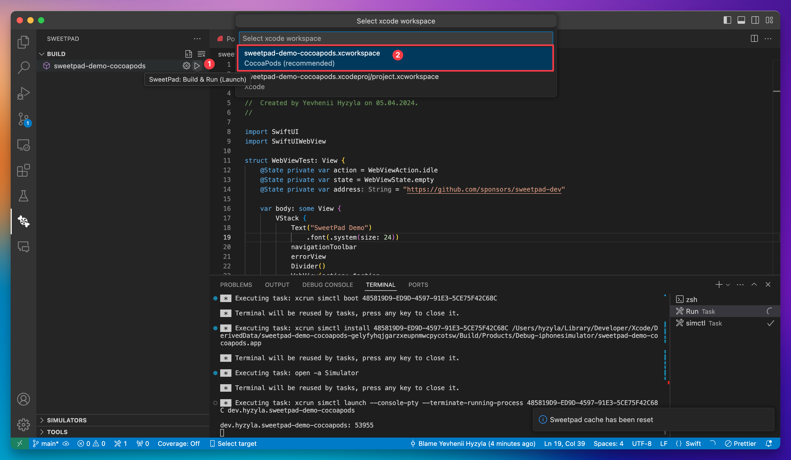

# Sweetpad Demo CocoaPods

This is a demo project for testing the Sweetpad with CocoaPods project.

1. Install the Sweetpad from VSCode Extension Marketplace.
2. Open project in VSCode.
3. Open the Sweetpad panel from the sidebar.
4. Click "Build & Run" button next to the "sweetpad-demo-cocoapods" scheme.
5. Select simulator or device to run the project.
6. Select recommended .xcworkspace project